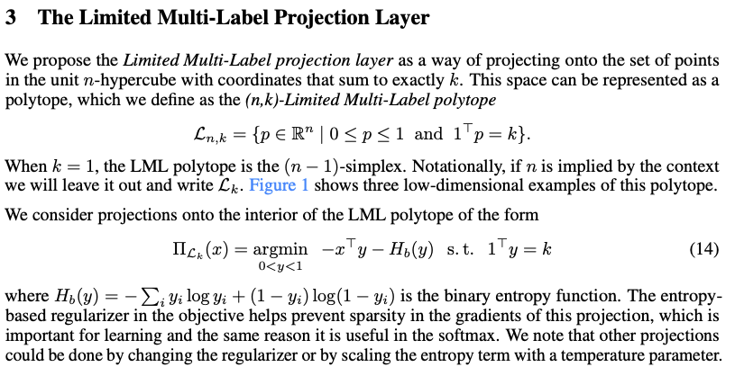

# The Limited Multi-Label Projection Layer

This repository is by Brandon Amos, Vladlen Koltun, J. Zico Kolter and
contains the PyTorch library and source code to reproduce the
experiments in our tech report on
[The Limited Multi-Label Projection Layer](https://arxiv.org/abs/1906.08707).




---

We provide the LML layer as a PyTorch module in `lml.py`.
You can install it with:

```
pip install git+git://github.com/locuslab/lml.git
```

A simple usage example to project a 5-dimensional vector
onto the LML polytope with two active elements is:

```python
import torch
from lml import LML

x = 10.*torch.randn(5) # tensor([ -4.0695,  10.8666,  13.0867,  -7.1431, -14.7220])
y = LML(N=2)(x) # tensor([5.8745e-04, 9.9945e-01, 9.9994e-01, 2.7187e-05, 1.3897e-08]))
```

# Top-k Image Classification
In the `smooth-topk` directory, we have connected the LML layer to the
PyTorch experiments in the
[oval-group/smooth-topk](https://github.com/oval-group/smooth-topk)
repository.
We ran these experiments with PyTorch 1.0.

A single LML training run can be done from the `smooth-topk/src` directory with

```
./main.py --dataset cifar100 --model densenet40-40 --out-name /tmp/lml-cifar --loss lml --noise 0.0 --seed 0 --no-visdom
```

Coordinating all of the CIFAR-100 experiments can be done with
the `./scripts/cifar100_noise_*.sh` scripts.

We have also added an option to use the 
[NVIDIA/DALI](https://github.com/NVIDIA/DALI)
library for pre-processing ImageNet images on the GPU,
but [DALI currently has known memory leaks](https://github.com/NVIDIA/DALI/issues/344)
that currently cause the experiments to crash and
run out of memory.

# Neural Motifs: Scene Graph Generation

In the `neural-motifs` directory, we have connected the LML layer to the
PyTorch experiments in the
[rowanz/neural-motifs](https://github.com/rowanz/neural-motifs)
repository.
The `README` in this directory provides more details about
setting up and running the experiments.
The original code has not been updated to the latest version of
PyTorch and these experiments should be run with PyTorch 0.3.

A single LML training run can be done from the `neural-motifs` directory with

```
python3 models/train_rels.py -m predcls -model motifnet -order leftright -nl_obj 2 -nl_edge 4 -b 6 -clip 5 -p 10 -hidden_dim 512 -pooling_dim 4096 -lr 1e-3 -ngpu 1 -ckpt checkpoints/vg-faster-rcnn.tar -save_dir /tmp/lml-nm -nepoch 50 -use_bias --lml_topk 20
```

Coordinating all of the experiments can be done with
`/scripts/train_predcls.sh`.

# Licensing

Our LML layer in `lml.py` is licensed under the MIT license.
All other code in this repository remains under the
original licensing.

If you find this repository helpful in your publications,
please consider citing our paper.

```
@article{amos2019limited,
  title={{The Limited Multi-Label Projection Layer}},
  author={Brandon Amos and Vladlen Koltun and J. Zico Kolter},
  journal={arXiv preprint arXiv:1906.08707},
  year={2019}
}
```
